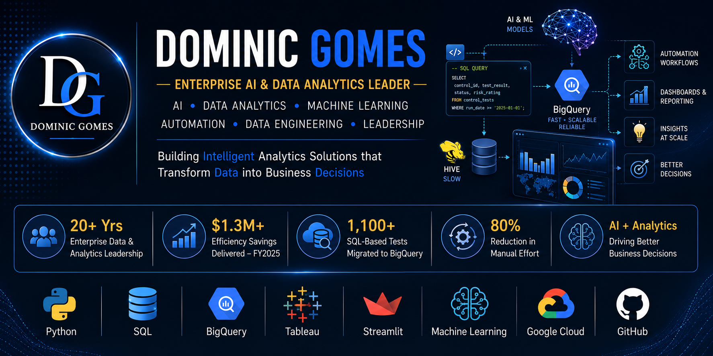

  

# 🧑 **About Me:**
I'm an **Enterprise Data & Analytics Leader** with nearly two decades of experience transforming complex data into business decisions through analytics, automation, and AI-driven solutions.

Throughout my career, I've led enterprise reporting and analytics initiatives supporting **1,100+ global testing and governance programs**, delivering measurable business outcomes—including **$1.3M+ in efficiency savings** and an **80% reduction in manual analytical effort** through automation and platform modernization.

Today, my focus extends beyond reporting. I'm passionate about building **AI-powered analytics applications**, developing **machine learning models**, designing **data engineering pipelines**, and creating intelligent automation that helps organizations make faster, smarter, and more reliable decisions.

On this GitHub, you'll find projects covering:

* 🤖 AI Agents & LLM Applications
* 🧠 Machine Learning & Predictive Analytics
* 📊 Business Intelligence & Interactive Dashboards
* ☁️ Google Cloud, BigQuery & Data Engineering
* 🐍 Python, SQL & Enterprise Automation
* 📈 End-to-End Data Science Projects

**My goal** is simple: **combine deep business understanding with modern AI and data technologies to build solutions that create measurable business value.**

Whether it's developing an AI-powered SQL assistant, building predictive risk models, automating enterprise workflows, or designing executive dashboards, I enjoy solving real business problems with data.

## 🌐 Socials:
   

# 🖥️ Tech Stack:
🤖 **AI Agents & LLM Applications:**

🧠 **Machine Learning & Data Science:**

🐍 **Programming:**

📊 **Analytics & Visualization:**

📈 **Data Engineering:**

⚡ **Automation & Apps:**

💼 **Enterprise Tools:**

💻 **Development:**

⭐ **Competencies:**

